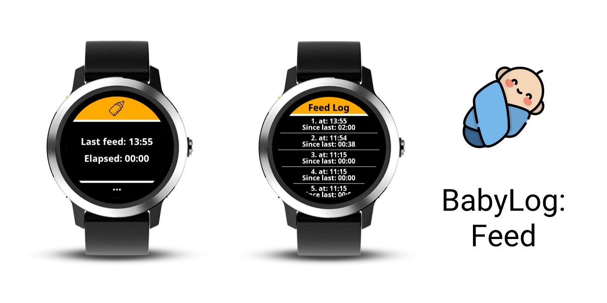
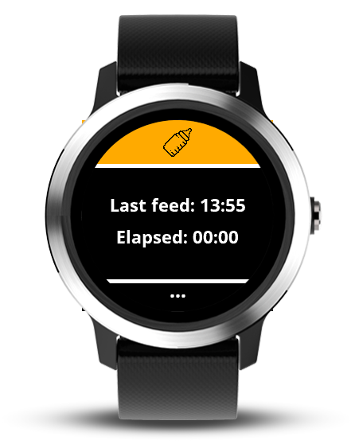
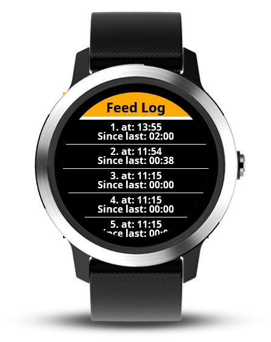

A Widget for Garmin ConnectIQ (currently: VivoActive 3 / 4 / 4s & Venu)

## Intention
This is a simple widget used to mark / log the times you feed your baby.
I created this during my parental leave to help me remember when the baby had his last meal.

The data is directly stored on the device.
The last 10 feeds are stored.

## Use
- Tap on the yellow button at the top to add a new feed time
- Tap on the three dots at the bottom to open the log screen with the ten last feed times.
- On the second screen:
-- Scroll up and down to see all ten entries
-- Swipe left to go back

## Screenshots

## Disclaimer
This is my first ConnectIQ app and I tailored it completely to my wishes / needs.
It may or may not be improved in the future.
Feel free to send me any comments.

## Credits
- Baby bottle (on upper right combo button): Icons made by <a href="http://www.freepik.com" title="Freepik">Freepik</a> from <a href="https://www.flaticon.com/" title="Flaticon">www.flaticon.com</a> is licensed by <a href="http://creativecommons.org/licenses/by/3.0/" title="Creative Commons BY 3.0" target="_blank">CC 3.0 BY</a>
- Application icon: Icons made by <a href="http://www.freepik.com" title="Freepik">Freepik</a> from <a href="https://www.flaticon.com/" title="Flaticon">www.flaticon.com</a> is licensed by <a href="http://creativecommons.org/licenses/by/3.0/" title="Creative Commons BY 3.0" target="_blank">CC 3.0 BY</a>

## Contact
[fh.development@zoho.eu](fh.development@zoho.eu)
